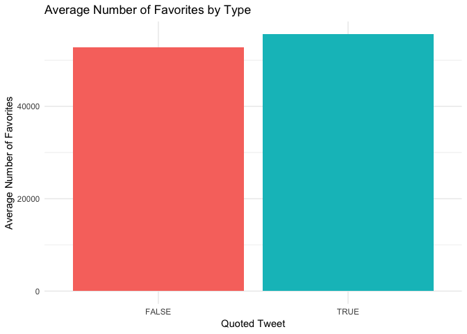

HW 09
================
Vivek Ramakrishnan
11/28/2018

A Text Analysis of Ariana Grande's Tweets
-----------------------------------------

### Introduction

Ariana Grande is largely considered one of the most prolific artists of our generation. Essential to being a popstar in 2018 is your social media presence. Grande is quite active over Twitter and has gained a substantial following after the release of her hit song, 'Thank u Next'. Her tweets range from feuds with Piers Morgan, interacting with fans, and a budding friendship with Mark Hamil.


In this assignment, I will perform a sentiment analysis on Grande's tweets, as well as some classification to examine the temporal trends of her Twitter feed and her favorite counts by tweet.

### Dataset

I use the `twitteR` package to retrieve the 4000 most recent tweets by Ariana Grande, not including retweets. I created a Twitter Development account and created and stored API keys and tokens for accessing the app in my .Rprofile page. I call the retrived tweets `grande`. I have saved her tweets as of 12/2 in a csv file for reproducibility.

``` r
# Create a token containing API keys. Private information stored in a .Rprofile file
twitter_token <- create_token(
  app = appname,
  consumer_key = key, 
  consumer_secret = secret,
  access_token = access_token,
  access_secret = access_secret
)

# Use this command to pull Ariana Grande's 4000 most recent tweets

# grande <- get_timeline(user = 'ArianaGrande',
#                      n = 4000,
#                      include_rts = FALSE,)


# For reproducibility, I have saved her recent tweets as a .csv in this repository
grande <- read_csv('grande.csv')
```

    ## Warning: Missing column names filled in: 'X1' [1]

    ## Parsed with column specification:
    ## cols(
    ##   X1 = col_character(),
    ##   status_id = col_double(),
    ##   created_at = col_datetime(format = ""),
    ##   text = col_character(),
    ##   source = col_character(),
    ##   is_quote = col_logical(),
    ##   is_retweet = col_logical(),
    ##   retweet_count = col_double(),
    ##   favorite_count = col_double(),
    ##   quoted_name = col_character()
    ## )

``` r
kable(head(grande))
```

| X1             |  status\_id| created\_at         | text                               | source             | is\_quote | is\_retweet |  retweet\_count|  favorite\_count| quoted\_name   |
|:---------------|-----------:|:--------------------|:-----------------------------------|:-------------------|:----------|:------------|---------------:|----------------:|:---------------|
| ArianaGrande.1 |    1.07e+18| 2018-12-02 19:32:21 | next tat <https://t.co/WryqtSUqkh> | Twitter for iPhone | TRUE      | FALSE       |            2890|            44910| nicole 27      |
| ArianaGrande.2 |    1.07e+18| 2018-12-02 19:18:09 | 🖤 <https://t.co/2wzXm6BxoU>        | Twitter for iPhone | FALSE     | FALSE       |            4708|            26739| NA             |
| ArianaGrande.3 |    1.07e+18| 2018-12-02 19:10:38 | yooooo <https://t.co/eR5WCwkCIC>   | Twitter for iPhone | TRUE      | FALSE       |            4412|            56252| martina        |
| ArianaGrande.4 |    1.07e+18| 2018-12-02 18:53:29 | 🖤 <https://t.co/n6cqmK873v>        | Twitter for iPhone | TRUE      | FALSE       |            2281|            27771| torin          |
| ArianaGrande.5 |    1.07e+18| 2018-12-02 18:50:34 | i- <https://t.co/E4OrVSN0YZ>       | Twitter Web Client | TRUE      | FALSE       |            4967|            53850| ingrid         |
| ArianaGrande.6 |    1.07e+18| 2018-12-02 18:44:17 | 🖤 <https://t.co/6PRc6hFzBZ>        | Twitter for iPhone | TRUE      | FALSE       |            1693|            20428| Alfredo Flores |

A quick glance at Ariana Grande's Twitter feed shows that she interacts with her fans, other celebrities, and haters quite a bit. She interacts with others primarily by quoting tweets she has recieved. The following graph shows the total number of quoted tweets vs. normal tweets in her last 4000 tweets.

``` r
grande %>% 
  
# Count the number of tweets by Quote = TRUE and Quote = FALSE  
  count(status_id, is_quote) %>% 
  ggplot() + 
  
# Graph  
  geom_bar(aes(x = is_quote, y = n, fill = is_quote), 
           stat = 'identity') +
  
# Labels  
  labs(x = "Quoted Tweet",
       y = "# of Tweets",
       title = "Grande: Quoted Tweets vs. Normal Tweets") + 
  guides(fill=FALSE)
```


Some of her quoted tweets, especially ones that are rather pointed, garner a lot more favorites than individual tweets replying to fans


The following bar graph shows the average number of favorites for quoted tweets vs. normal tweets.

``` r
grande %>% 

# Summarize the average favorites by quote type    
  group_by(is_quote) %>% 
  summarize(n = mean(favorite_count)) %>%
  
# graph  
  ggplot() + 
  geom_bar(aes(x = is_quote, y = n, fill = is_quote), 
           stat = 'identity') +
  
# labels  
  labs(x = "Quoted Tweet",
       y = "Average Number of Favorites",
       title = "Average Number of Favorites by Type") + 
  guides(fill=FALSE)
```



Quoted tweets recieve *slightly* more favorites than non-quoted tweets. Clearly there is some interesting relationship between Grande's content and the number of favorites she recieves. I am interested in preforming a text analysis on Ariana Grande's Twitter feed to determine which types of tweets and sentiments recieve the most favorites.

First, I tidy the data, split each tweet by word, and remove stopwords and links. I then categorized the number of favorites into 5 categories, from very low to very high. The breaks I chose for this categorization was somewhat arbitrary; I have seen Ariana Grande's tweets on my timeline range from less than 50,000 favorites to over 600,000 favorites. The other delineations were randomly chosen from inuition. The `reg` pattern was adapted from [David Robinson's text analysis of Trump's tweets](http://varianceexplained.org/r/trump-tweets/).

``` r
# Store 'reg' as a pattern that means any alphabetic character and '@', indicating a user
reg <- "([^A-Za-z\\d#@']|'(?![A-Za-z\\d#@]))"

# Tidy data set
grande_tidy <- grande %>%
  
# Create ID for each tweet  
  rowid_to_column('ID') %>%
  
# Select relevant columns  
  dplyr::select(text, favorite_count, retweet_count, ID, created_at) %>%
  
# Remove tweets that start with quotation marks - common for soft retweets
  filter(!str_detect(text, '^"')) %>%
  
# Replace links with null  
  mutate(text = str_replace_all(text, "https://t.co/[A-Za-z\\d]+|&amp;", "")) %>%

# Unnest tokens by defined reg pattern; split text into individual words
  unnest_tokens(word, text, token = "regex", pattern = reg) %>%

# Remove stop words  
  filter(!word %in% stop_words$word,
         str_detect(word, "[a-z]")) %>%
  anti_join(stop_words) %>%
  
# Create classifications for favorite counts  
  mutate(fav=cut(favorite_count, breaks=c(0, 50000, 100000, 300000, 600000, Inf), labels=c('very low',"low","middle","high",'very high')))
```

    ## Joining, by = "word"

``` r
kable(head(grande_tidy))
```

|  favorite\_count|  retweet\_count|    ID| created\_at         | word            | fav      |
|----------------:|---------------:|-----:|:--------------------|:----------------|:---------|
|             3121|             774|  3124| 2017-04-06 04:45:29 | @arigiows       | very low |
|             3145|             777|  3122| 2017-04-06 04:45:55 | @bangbangbutera | very low |
|             3145|             777|  3122| 2017-04-06 04:45:55 | @bemybabyariana | very low |
|             3145|             777|  3122| 2017-04-06 04:45:55 | smiling         | very low |
|             3230|             743|  3028| 2017-05-07 23:49:31 | @behoeright     | very low |
|             3247|             776|  3120| 2017-04-06 04:47:43 | @funsizedariana | very low |

After cleaning and categorizing the data I wanted to know the words that appeared the most in the different favorite classes of her Tweets.

``` r
grande_tidy %>%
  # delete stopwords
  anti_join(stop_words) %>%
  # summarize count per word per favorite classification
  count(fav, word) %>%
  # highest freq on top
  arrange(desc(n)) %>% 
  # rank within group
  group_by(fav) %>% 
  mutate(top = seq_along(word)) %>%
  # retain top 10 frequent words
  filter(top <= 10) %>%
  # create barplot
  ggplot(aes(x = -top, y = n, fill = fav)) + 
  geom_col(color = "black") +
  # print words in plot instead of as axis labels
  geom_text(aes(label = word), hjust = "left", nudge_y = 100) +
  labs(title = "Most frequent words in Grande's Twitter",
       x = NULL,
       y = "Word count") +
  facet_wrap( ~ fav) +
  coord_flip() +
  theme(legend.position = "none",
        # rotate x text
        axis.text.x = element_text(angle = 45, hjust = 1),
        # remove tick marks and text on y-axis
        axis.ticks.y = element_blank(),
        axis.text.y = element_blank())
```

    ## Joining, by = "word"


From the graphs, the majority of her tweets fall under 'very low' favorites distinction I created. Or tweets with less than 50k favorites. Interestingly, the most common word Grande uses across four favorites categories is love, while for the highest-favorite tweets, the most common word is beautiful. The lowest-favorited tweets included two Twitter handles; likely belonging to 'stan' accounts - or Twitter accounts dedicated to tweeting at and about Grande. The tweets with the highest number of favorites have high frequency words dedicated to deeper and more weighty subjects; including 'broken', 'heart', and 'god'. I can recognize some of the words included in the very high category from her tweet after the Manchester Arena bombing, which tragically occured directly after her concert


The type of words included in each tweet seems to change quite significantly from category to category, so I wanted to look at the sentiments by category using the NRC word-emotion association lexicon.

``` r
# Join tidy data set with sentiments from tidytext package
grande_nrc <- grande_tidy %>%
  
# Use 'nrc' dictionary
  inner_join(get_sentiments('nrc')) %>%
  group_by(ID, sentiment)
```

    ## Joining, by = "word"

``` r
grande_nrc %>%
  ungroup %>%
# create n for words  
  count(word, sentiment)  %>%
  
# arrange by most appearing words in each sentiment  
  arrange(desc(n)) %>%
  group_by(sentiment) %>% # 
  mutate(top = seq_along(word)) %>%
  # retain top 5 frequent words
  filter(top <= 5) %>%
  # create barplot
  ggplot(aes(x = -top, y = n, fill = sentiment)) + 
  geom_col(color = "black") +
  # print words in plot instead of as axis labels
  geom_text(aes(label = word), hjust = "left", nudge_y = 100) +
  labs(title = "Most frequent words in Tweets",
       x = NULL,
       y = "Word count") +
  ylim(c(-1,900)) +
  facet_wrap( ~ sentiment, ncol = 5) +
  coord_flip() +
  theme(legend.position = "none",
        # rotate x text
        axis.text.x = element_text(angle = 45, hjust = 1),
        # remove tick marks and text on y-axis
        axis.ticks.y = element_blank(),
        axis.text.y = element_blank())
```


This first graph shows the most frequent words in each of the 10 NRC categories across all tweets. Grande seems to generally tweet about positive and joyful things; carried by the word 'love'. Some of the words in the NRC categories do not seem to exactly match up- such as 'honest' in the categories 'anger', 'disgust', and 'fear'. The word was likely included in the phrase 'to be honest' - which can mean various things. Also 'screaming' isn't necessarily used in anger on Twitter - it is commonly slang for being excited or laughing about something. 'Sick' is also used as slang for 'cool' - yet NRC percieves it as 'disgust' in its sentiment matching. Clearly, the NRC dictionary doesn't do a perfect job in sentiment matching for Twitter/online slang. Perhaps there needs to be a new dictionary that accounts for the often sardonic and ironic use of words in internet slang.


I also want to know the ways in which Grande's tweets change temporally. The following graph shows her sentiment frequency by month, over her past year (the earliest of the 4000 tweets selected starts in March, 2017).

``` r
grande_nrc %>%

# Create month and year columns from 'created_at' variable  
  mutate(month = format(created_at, '%m'),
         year = format(created_at, '%y')) %>%

# Filter only tweets from this year    
  filter(year == 18) %>%

# Count sentiments per month    
  count(sentiment, month) %>%

# Remove 'positive and negative' sentiments    
  filter(!(sentiment %in% c("positive", "negative"))) %>%
  
# create area plot
  ggplot(aes(x = month, y = n)) +
  geom_col(aes(fill = sentiment)) + 
  theme(legend.position = 'none') +
  labs(x = "Month", y = "Emotion score", # add labels
       title = "Ariana Grande: Emotions over the Year",
       subtitle = "Using tidytext and the nrc sentiment dictionary") +
  
# seperate plots per sentiment and book and free up x-axes
  facet_grid(sentiment~., scale = "free")
```


Of course, there are very few tweets generally in December because it just started, but interestingly, Grande tweeted very little from January until May of this year. She tweeted the most, across all sentiments, in June. From this graph, it appears as though the sentiments she tweets are relatively proportinal accross months; it doesn't appear as if Grande had one particularly joyful, or fearful month according to this sentiment analysis. It appears that she tweeted relatively more 'surprise' words in July - but only marginally so. Rather than temporally, it might be more interesting to see how sentiment maps on to favorite count.

The following code and graph uses term frequency weighting on the sentiments of each favorite-count category to count how frequently sentiments appears in each classification.

``` r
grande_tf <- grande_tidy %>%

# Join sentiments using NRC dictionary    
  inner_join(get_sentiments('nrc')) %>%

# Count sentiments by favorite classification    
  count(fav, sentiment)  %>%

# Calculate term frequency for sentiment    
  bind_tf_idf(term = sentiment, document = fav, n = n)
```

    ## Joining, by = "word"

``` r
plot_grande <- grande_tf %>%
  arrange(desc(tf))  %>%
# Make sentiment a factor, with levels for unique sentiment in descending order
  mutate(sentiment = factor(sentiment, levels = rev(unique(sentiment))))


# graph the top 10 tokens for favorite categories
plot_grande %>%
  group_by(fav) %>%
  top_n(10) %>%
  ungroup() %>%
  ggplot(aes(sentiment, tf)) +
  geom_col() +
  labs(x = NULL, y = "tf") +
  facet_wrap(~fav, scales = "free") +
  coord_flip()
```

    ## Selecting by tf_idf


From the graph, tweets in categories of very low favorites up to high favorites follow a similar pattern. Most contain sentiments that are highly positive and joyful, and have low term frequencies for sentiments like 'disgust', and 'fear'. However, Grande's most favorited tweets are overwhelmingly negative, sad, fearful, and angry. The distribution is distinctly different from the other classifications of favorite counts. These tweets likely represent her tweets after the Manchester bombing, after the death of Mac Miller, and various call-out tweets, such as those at Piers Morgan. Tragically, it seems like her most favorited tweets come from difficult experiences.

To further this claim, I also use the Afinn dictionary, which assigns ordinal values to words based on how negative/positive the connotation is, on a scale from -5 to 5. For example, a word like 'love' may recieve a score of +3, while 'scare' recieves a score of -2. For this next section, I add the Afinn score of all words in a tweet to determine the overal score by tweet, and then compute the average Afinn score of tweets per favorite-count classification.

``` r
grande_afinn <- grande_tidy %>%
# Join with afinn dictionary    
  inner_join(get_sentiments('afinn')) %>%
# group by tweet and favorite classification    
  group_by(ID, fav) %>%
# Create total score per tweet    
  summarize(avg_score = sum(score))
```

    ## Joining, by = "word"

``` r
# Total tweets by favorite classification
ariana_count <- grande_tidy %>%
  count(fav)


grande_afinn2 <- grande_afinn %>%
    group_by(fav) %>%
# Calculate average score of tweets per favorite classification  
    summarize(score = mean(avg_score))  %>%
  
# Add total tweets in each classification  
    inner_join(ariana_count) %>%
# create positive and negative  
    mutate(sign = ifelse(score > 0, 'positive', 
                         ifelse(score < 0, 'negative', 'NA')))
```

    ## Joining, by = "fav"

``` r
# Table of favorite classification and score 
kable(grande_afinn2)
```

| fav       |  score|     n| sign     |
|:----------|------:|-----:|:---------|
| very low  |   2.19|  8425| positive |
| low       |   2.32|  2198| positive |
| middle    |   1.94|   875| positive |
| high      |   1.64|   191| positive |
| very high |  -1.75|    17| negative |

``` r
# Graph
ggplot(grande_afinn2) + 
  geom_bar(aes(x=fav, score, fill = sign), stat = 'identity') +
  labs(x = "Favorites", 
       y = "Afinn Score",
       title = "Ariana Grande's Favorites by Sentiment Scale") + 
  guides(fill=FALSE)
```


The graph shows that in general, Grande's more favorited tweets are more negative in sentiment. The Afinn score decreases quite significantly from 'high' favorited tweets to 'very high' favorited tweets - and it is the only classification that has a negative average Afinn score. Other than a slight rise in score from very low to low favorited tweets, in general there is a negative trend in positive sentiments and favorite count. This generally supports the claim that Grande's more favorited tweets are more negative.

However, the favorite-classification I chose is somewhat arbitrary. It is possible that the trends change based on the buckets included. To correct for this, I made a plot of a linear regression of Afinn score and the number of favorites of each tweet.

``` r
# Join afinn score and all sentiments
grande_reg <- grande_afinn %>%
  inner_join(grande_nrc) %>%
# only distinct values  
  distinct()
```

    ## Joining, by = c("ID", "fav")

``` r
# Graph linear regression of favorites and Afinn Score
ggplot(grande_reg) + 
  geom_point(aes(x = favorite_count, 
                 y= avg_score, 
                 color = fav)) + 
  geom_smooth(aes(x = favorite_count, 
                  y= avg_score), 
              method = 'lm') + 
  labs(x = "Favorites", 
       y = "Afinn Score",
       title = "Ariana Grande's last 4000 Tweets",
       color = 'Favorite Classification')
```


Overall, the trend appears to be negative, confirming the last few claims. However, it is clear there are quite a few influential points with high favorite counts and are slightly negative.

### Conclusion

I hope this analysis was illuminating in providing some analysis into Ariana Grande's Twitter feed. It is a somewhat trivial example, but I think such an analysis is really important for marketing and messaging. Social capital is very real, and can be measured quite tangibly by things like followers, retweets, and favorites. Understanding what sorts of tweets, words, or messages resonate the most with your audience is incredibly important for politicians, celebrities, and companies alike. Of course, there are some limitations with such an assumption. The order and type of words, of course, matters - the sentiment analysis that I conducted only considers and weighs the overall emotion of a tweet. Context also matters. Simply including 'sad' words in a tweet will not get you 1 million favorites, as it has for Grande. It might be interesting to try to quantify such contextual factors and see how different emotions in tweets elicit different favorite counts in different settings. For example, does tweeting favorably about a Republican politician after they do something percieved as liberal recieve more favorites than tweeting negatively after they do something percieved as conservative. It might be interesting to see how sentiments can help us understand public opinion and questions of psychology.
